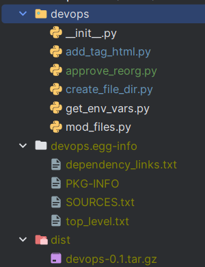

### Doc para armar los paquetes

Armar en la raíz el python package dir con el nombre de la libreria con su __init__py.
Crear el file setup.py en la raíz.

````python
from setuptools import setup, find_packages

# Información de la librería
LIBRARY_NAME = 'devops'
VERSION = '0.1'
DESCRIPTION = 'Una librería genial para reutilizar y actualizar globalmente código'
AUTHOR = 'Iván Tomasevich'
AUTHOR_EMAIL = 'ivantomasevich@pm.me'
URL = 'https://github.com/IvanTomasevich/DevOpsLib'
LICENSE = 'GPL-3.0'

# Cargar el contenido del README como descripción larga
with open('README.md', 'r', encoding='utf-8') as readme_file:
    LONG_DESCRIPTION = readme_file.read()

setup(
    name=LIBRARY_NAME,
    version=VERSION,
    description=DESCRIPTION,
    long_description=LONG_DESCRIPTION,
    long_description_content_type='text/markdown',
    author=AUTHOR,
    author_email=AUTHOR_EMAIL,
    url=URL,
    license=LICENSE,
    packages=find_packages(),
    install_requires=[
        # Dependencias de tu librería, si las hay
    ],
    classifiers=[
        'Development Status :: 3 - Alpha',
        'Intended Audience :: Developers-DevOps',
        'License :: OSI Approved :: GNU General Public License v3 (GPLv3)',
        'Programming Language :: Python :: 3.10',
    ],
)
````
#### Command exec para armar el package

Ejecutar el siguiente comando en la raíz, donde se encuentra el archivo (setup.py) y el dir de la libreria.

````commandline
python setup.py sdist
````
Esto va a crear el dir (devops.eg-info) con los metadatos del package y
el directorio dist con la librería (*.tar.gz) para instalar


